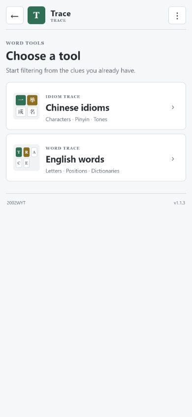

<div align="center">

# Trace · 词迹

### Two fully offline word-solving tools in one app

Solve four-character Chinese idioms or filter English words from gray, yellow, and green clues. Use the tools in a browser or install the unified Android app.

[](https://github.com/2002WYT/Trace/releases/latest)
[](https://github.com/2002WYT/Trace/releases/latest)
[](#privacy-and-offline-use)
[](#android-app)
[](./LICENSE)

[**Try online**](https://2002wyt.github.io/Trace/)
·
[**Download Android APK**](https://github.com/2002WYT/Trace/releases/download/v1.1.3/Trace-v1.1.3.apk)
·
[**Changelog**](./CHANGELOG.md)
·
[**How to publish an update**](./GIT_UPLOAD_GUIDE.md)

**by 2002WYT**

<br>



</div>

## Online version

Open the [Trace online version](https://2002wyt.github.io/Trace/) on a phone or desktop browser. GitHub Pages publishes the same pages used by the Android app whenever `main` is updated.

## Included tools

| Tool | Purpose | Standalone file |
| --- | --- | --- |
| **Idiom Trace** | Filter four-character Chinese idioms by character, initial, final, and tone clues | [`idiom-trace/idiom-trace-offline.html`](./idiom-trace/idiom-trace-offline.html) |
| **Word Trace** | Filter 2–18 letter English words by gray, yellow, and green clues | [`word-trace/word-trace-offline-en.html`](./word-trace/word-trace-offline-en.html) |

Both standalone pages contain their data and filtering logic in a single file and continue to work without a network connection.

## Android app

Trace 1.1.3 provides:

- English, Simplified Chinese, and Traditional Chinese interfaces;
- System, Light, and Dark appearance modes;
- both solvers and their dictionaries inside one app;
- compact phone layouts based on familiar productivity-tool patterns;
- three text-size options, optional transitions and haptic feedback;
- optional screen wake lock and resume-last-tool behavior;
- no account, ads, analytics, or network permission.

### Install

1. Download the latest APK from [Releases](https://github.com/2002WYT/Trace/releases/latest).
2. Open the APK on an Android device.
3. If Android asks, allow the current browser or file manager to install unknown apps.
4. Choose **Install**, or **Update** when an older version is already present.

The minimum supported version is Android 6.0 (API 23).

## Build the Android APK

Open [`android`](./android) in Android Studio, or build from PowerShell:

```powershell
cd android
.\gradlew.bat lintDebug assembleDebug
```

The build requires JDK 17 or later and Android SDK 36. The debug APK is written to:

```text
android/app/build/outputs/apk/debug/app-debug.apk
```

If those tools are not installed locally, run **Build Android APK / 构建 Android APK** in GitHub Actions; version tags trigger it automatically.

For the exact commit, push, tag, release, APK upload, checksum, GitHub Pages, and repository About steps, see [GIT_UPLOAD_GUIDE.md](./GIT_UPLOAD_GUIDE.md).

## Repository layout

```text
Trace/
├─ idiom-trace/          standalone Idiom Trace page and documentation
├─ word-trace/           standalone Word Trace page and documentation
├─ android/              Android Studio project
├─ .github/workflows/    GitHub Pages publishing workflow
├─ docs/releases/        bilingual release notes
├─ docs/images/          project screenshots
├─ CHANGELOG.md          complete version history
├─ GIT_UPLOAD_GUIDE.md   update and release instructions
├─ LICENSE               MIT License
└─ README.md             project overview
```

## Privacy and offline use

All filtering runs locally:

- no clue or usage data is uploaded;
- no cookies, analytics, or tracking services are used;
- no server or database is required;
- the Android app requests no network permission;
- downloaded pages and the APK work offline.

The GitHub link on the About page is opened by the device's external browser.

## Data and acknowledgements

- Chinese idiom data is derived from [`pwxcoo/chinese-xinhua`](https://github.com/pwxcoo/chinese-xinhua).
- The English exam-list generation workflow references public lists from [`araea/koishi-plugin-wordle-game`](https://github.com/araea/koishi-plugin-wordle-game).

## License

Trace is released under the [MIT License](./LICENSE).

---

# 词迹 · Trace

### 一个应用，两款完全离线的猜词辅助工具

根据汉字、拼音和声调线索筛选四字成语，或根据灰、黄、绿线索筛选英语单词。既可直接在浏览器中使用，也可安装统一的 Android 应用。

[**在线试玩**](https://2002wyt.github.io/Trace/)
·
[**下载 Android APK**](https://github.com/2002WYT/Trace/releases/download/v1.1.3/Trace-v1.1.3.apk)
·
[**查看更新日志**](./CHANGELOG.md)
·
[**学习如何上传更新**](./GIT_UPLOAD_GUIDE.md#中文指南)

## 在线版

在手机或电脑浏览器中打开[词迹在线版](https://2002wyt.github.io/Trace/)即可使用。`main` 分支更新后，GitHub Pages 会自动发布与 Android 应用相同的页面。

## 包含的工具

| 工具 | 用途 | 独立文件 |
| --- | --- | --- |
| **语迹 · Idiom Trace** | 根据汉字、声母、韵母和声调线索筛选四字成语 | [`idiom-trace/idiom-trace-offline.html`](./idiom-trace/idiom-trace-offline.html) |
| **Word Trace** | 根据灰色、黄色和绿色线索筛选 2～18 个字母的英语单词 | [`word-trace/word-trace-offline-en.html`](./word-trace/word-trace-offline-en.html) |

两份独立网页均把数据和筛选逻辑装在单个文件中，下载后可断网运行。

## Android 应用

词迹 1.1.3 提供：

- 英语、简体中文和繁体中文界面；
- 跟随系统、浅色和深色三种外观模式；
- 一个应用内的两款工具及完整题库；
- 参考成熟效率工具整理的紧凑手机布局；
- 三档文字大小，以及可选的过渡动画和触感反馈；
- 可选的解题时保持屏幕常亮和启动时继续上次工具；
- 无账号、无广告、无统计服务，不申请网络权限。

### 安装

1. 从 [Releases](https://github.com/2002WYT/Trace/releases/latest) 下载最新 APK。
2. 在 Android 设备上打开 APK。
3. 如果系统询问，允许当前浏览器或文件管理器“安装未知应用”。
4. 选择“安装”；已安装旧版时选择“更新”。

最低支持 Android 6.0（API 23）。

## 构建 Android APK

推荐使用 Android Studio 打开 [`android`](./android) 目录，也可以在 PowerShell 中构建：

```powershell
cd android
.\gradlew.bat lintDebug assembleDebug
```

需要 JDK 17 或更新版本以及 Android SDK 36。调试 APK 位于：

```text
android/app/build/outputs/apk/debug/app-debug.apk
```

如果本机没有这些工具，可在 GitHub Actions 中运行 **Build Android APK / 构建 Android APK**；推送版本标签时也会自动触发。

提交、推送、打标签、创建 Release、上传 APK、生成校验值、检查 GitHub Pages 和修改仓库 About 的完整流程，请阅读 [GIT_UPLOAD_GUIDE.md](./GIT_UPLOAD_GUIDE.md#中文指南)。

## 仓库结构

```text
Trace/
├─ idiom-trace/          语迹独立网页与说明
├─ word-trace/           Word Trace 独立网页与说明
├─ android/              Android Studio 工程
├─ .github/workflows/    GitHub Pages 发布流程
├─ docs/releases/        中英双语发布说明
├─ docs/images/          项目截图
├─ CHANGELOG.md          完整版本记录
├─ GIT_UPLOAD_GUIDE.md   更新与发布指南
├─ LICENSE               MIT 许可证
└─ README.md             项目总览
```

## 隐私与离线运行

所有筛选都在本地完成：

- 不上传线索或使用数据；
- 不使用 Cookie、统计或跟踪服务；
- 不需要服务器或数据库；
- Android 应用不申请网络权限；
- 网页和 APK 下载后均可离线使用。

“关于”页面中的 GitHub 链接会交给设备的外部浏览器打开。

## 数据与致谢

- 成语数据来源于 [`pwxcoo/chinese-xinhua`](https://github.com/pwxcoo/chinese-xinhua)。
- 英语考试词表生成流程参考了 [`araea/koishi-plugin-wordle-game`](https://github.com/araea/koishi-plugin-wordle-game) 的公开词表。

## 许可证

本项目采用 [MIT License](./LICENSE)。

---

<div align="center">

Made for language learners and word-game solvers. / 为语言学习者与猜词玩家制作。

**© 2026 2002WYT**

</div>
