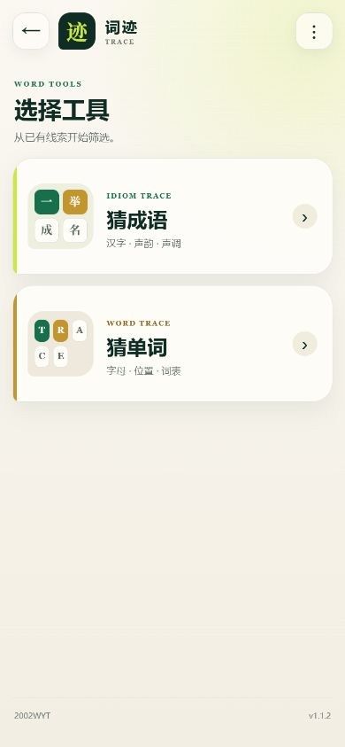

<div align="center">

# 词迹 · Trace

### 一个入口，两款完全离线的猜词辅助工具

猜成语，或根据灰、黄、绿线索筛选英语单词。网页版本可以直接下载使用，Android 版本将两个工具收进同一个应用。

[](https://github.com/2002WYT/Trace/releases/latest)
[](https://github.com/2002WYT/Trace/releases/latest)
[](#隐私与离线运行)
[](./LICENSE)

[**在线试玩**](https://2002wyt.github.io/Trace/)
·
[**下载 Android APK**](https://github.com/2002WYT/Trace/releases/download/v1.1.2/Trace-v1.1.2.apk)
·
[**查看版本记录**](./CHANGELOG.md)
·
[**进入 Releases**](https://github.com/2002WYT/Trace/releases)

**by 2002WYT**

<br>



<br>

<sub>Android 手机竖屏界面</sub>

</div>

---

## 在线试玩

打开 [**词迹 Trace 在线版**](https://2002wyt.github.io/Trace/)，无需安装即可在手机或电脑浏览器中使用猜成语和猜单词工具。

在线版与 Android 应用共用同一套页面源码；每次 `main` 分支更新后，GitHub Pages 会自动发布最新页面。

## 包含的工具

| 工具 | 用途 | 独立网页版 |
| --- | --- | --- |
| **语迹 · Idiom Trace** | 根据汉字、声母、韵母和声调线索筛选四字成语 | [`idiom-trace/idiom-trace-offline.html`](./idiom-trace/idiom-trace-offline.html) |
| **Word Trace** | 根据灰色、黄色和绿色线索筛选 2～18 个字母的英语单词 | [`word-trace/word-trace-offline-en.html`](./word-trace/word-trace-offline-en.html) |

两个原项目的文件和 Git 提交历史都保留在本仓库中。

## Android 版

Android 应用名为 **词迹 Trace**，主要功能包括：

- 一个应用内同时打开猜成语和猜单词工具；
- 题库、页面和筛选逻辑全部内置；
- 无账号、无广告、无分析服务；
- 不申请网络权限；
- 针对手机竖屏优化；
- 支持三档文字大小；
- 支持解题时保持屏幕常亮；
- 关于页面显示版本、作者和开源仓库。

### 安装

1. 从 [Releases](https://github.com/2002WYT/Trace/releases/latest) 下载最新版本的 APK 文件。
2. 将 APK 保存到 Android 手机并点击打开。
3. 如果系统询问，允许当前文件管理器或浏览器“安装未知应用”。
4. 选择“安装”；已安装旧版本时选择“更新”。

最低支持 Android 6.0（API 23）。

## 仓库结构

```text
Trace/
├─ idiom-trace/       语迹独立网页版及原仓库历史
├─ word-trace/        Word Trace 独立网页版及原仓库历史
├─ android/           Android Studio 工程
├─ .github/workflows/ GitHub Pages 自动发布配置
├─ docs/releases/     GitHub Release 更新说明
├─ docs/images/       项目截图
├─ CHANGELOG.md       完整版本记录
├─ LICENSE            MIT 许可证
└─ README.md          项目总览
```

## 构建 Android APK

推荐使用 Android Studio 打开 [`android`](./android) 目录。也可以使用命令行构建：

```powershell
cd android
.\gradlew.bat lintDebug assembleDebug
```

需要 JDK 17 或更新版本，以及 Android SDK 36。生成文件位于：

```text
android/app/build/outputs/apk/debug/app-debug.apk
```

## 隐私与离线运行

应用中的所有筛选都在设备本地完成：

- 不上传输入内容；
- 不使用 Cookie、统计或跟踪服务；
- 不需要服务器或数据库；
- Android 应用不申请网络权限；
- 下载完成后可在断网状态下使用。

“关于”页面中的 GitHub 链接会交给手机的外部浏览器打开。

## 数据与致谢

- 成语数据来源于开源项目 [`pwxcoo/chinese-xinhua`](https://github.com/pwxcoo/chinese-xinhua)。
- 英语考试词表生成流程参考了 [`araea/koishi-plugin-wordle-game`](https://github.com/araea/koishi-plugin-wordle-game) 中的公开词表。

## 许可证

本项目采用 [MIT License](./LICENSE)。

---

<div align="center">

Made for language learners, puzzle solvers, and word-game explorers.

**© 2026 2002WYT**

</div>
